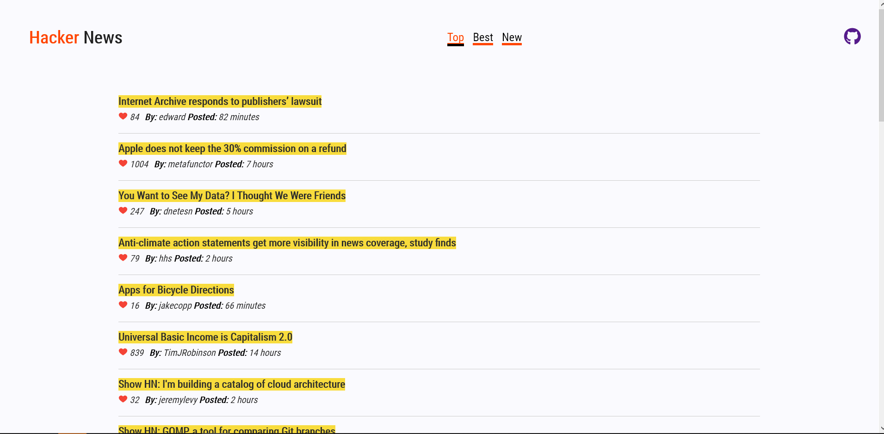

<h1 align="center">A HackerNews Clone built with React</h1>

Auto formatted with Prettier

<h3 align="center">
  <a href="https://reacthackernews.netlify.app">Visit the live app</a> |
</h3>

    <h3>Libraries Used</h3>
    <ul>
      <li>react</li>
      <li>react-router-dom</li>
      <li>styled-components</li>
      <li>axios</li>
    </ul>

